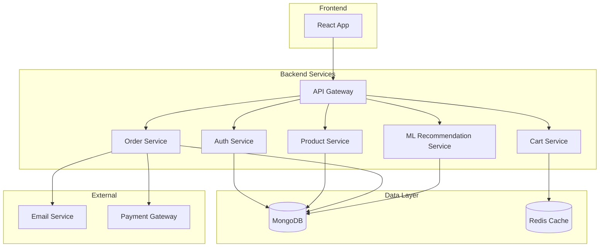

# Design Document

## Overview

The ecommerce application will follow a microservices architecture with a React frontend, Node.js backend services, and an ML-based recommendation engine. The system will be containerized using Docker and deployable via Docker Compose for local development and Kubernetes manifests for Kind cluster deployment.

## Architecture

### High-Level Architecture



### Technology Stack

- **Frontend**: React 18+ with TypeScript, Material-UI for components
- **Backend**: Node.js with Express.js, TypeScript
- **Database**: MongoDB for persistent data, Redis for session/cart storage
- **ML Framework**: Python with scikit-learn for recommendation algorithms
- **Containerization**: Docker and Docker Compose
- **Orchestration**: Kubernetes (Kind for local development)
- **API Communication**: REST APIs with JSON

## Components and Interfaces

### Frontend Components

#### Core React Components
- **App Component**: Main application wrapper with routing
- **ProductList**: Displays products with search and filtering
- **ProductDetail**: Shows individual product information
- **ShoppingCart**: Cart management interface
- **Checkout**: Order placement workflow
- **UserProfile**: Account management and order history
- **AdminPanel**: Product and order management for administrators

#### State Management
- **Context API**: For global state (user authentication, cart)
- **React Query**: For server state management and caching
- **Local Storage**: For cart persistence across sessions

### Backend Services

#### API Gateway Service
- **Port**: 3000
- **Responsibilities**: Request routing, authentication middleware, rate limiting
- **Endpoints**:
  - `/api/auth/*` → Auth Service
  - `/api/products/*` → Product Service
  - `/api/cart/*` → Cart Service
  - `/api/orders/*` → Order Service
  - `/api/recommendations/*` → ML Service

#### Authentication Service
- **Port**: 3001
- **Database**: MongoDB users collection
- **Features**: JWT token generation, password hashing (bcrypt), session management
- **Endpoints**:
  - `POST /register` - User registration
  - `POST /login` - User authentication
  - `GET /profile` - Get user profile
  - `PUT /profile` - Update user profile

#### Product Service
- **Port**: 3002
- **Database**: MongoDB products collection
- **Features**: Product CRUD operations, search functionality, category management
- **Endpoints**:
  - `GET /products` - List products with filtering
  - `GET /products/:id` - Get product details
  - `POST /products` - Create product (admin)
  - `PUT /products/:id` - Update product (admin)
  - `DELETE /products/:id` - Delete product (admin)

#### Cart Service
- **Port**: 3003
- **Database**: Redis for session-based carts
- **Features**: Cart item management, price calculations
- **Endpoints**:
  - `GET /cart/:userId` - Get user cart
  - `POST /cart/:userId/items` - Add item to cart
  - `PUT /cart/:userId/items/:itemId` - Update item quantity
  - `DELETE /cart/:userId/items/:itemId` - Remove item from cart

#### Order Service
- **Port**: 3004
- **Database**: MongoDB orders collection
- **Features**: Order processing, payment integration, email notifications
- **Endpoints**:
  - `POST /orders` - Create new order
  - `GET /orders/:userId` - Get user orders
  - `GET /orders/:id` - Get order details
  - `PUT /orders/:id/status` - Update order status (admin)

#### ML Recommendation Service
- **Port**: 3005
- **Technology**: Python Flask with scikit-learn
- **Database**: MongoDB for user behavior tracking
- **Features**: Collaborative filtering, content-based recommendations
- **Endpoints**:
  - `GET /recommendations/:userId` - Get personalized recommendations
  - `POST /interactions` - Track user interactions
  - `POST /retrain` - Trigger model retraining

## Data Models

### User Model
```typescript
interface User {
  _id: ObjectId;
  email: string;
  password: string; // hashed
  firstName: string;
  lastName: string;
  address?: {
    street: string;
    city: string;
    state: string;
    zipCode: string;
    country: string;
  };
  role: 'customer' | 'admin';
  createdAt: Date;
  updatedAt: Date;
}
```

### Product Model
```typescript
interface Product {
  _id: ObjectId;
  name: string;
  description: string;
  price: number;
  category: string;
  images: string[];
  inventory: number;
  tags: string[];
  createdAt: Date;
  updatedAt: Date;
}
```

### Order Model
```typescript
interface Order {
  _id: ObjectId;
  userId: ObjectId;
  items: {
    productId: ObjectId;
    quantity: number;
    price: number;
  }[];
  totalAmount: number;
  status: 'pending' | 'processing' | 'shipped' | 'delivered' | 'cancelled';
  shippingAddress: Address;
  paymentMethod: string;
  createdAt: Date;
  updatedAt: Date;
}
```

### User Interaction Model (for ML)
```typescript
interface UserInteraction {
  _id: ObjectId;
  userId: ObjectId;
  productId: ObjectId;
  interactionType: 'view' | 'cart_add' | 'purchase';
  timestamp: Date;
  sessionId: string;
}
```

## Error Handling

### Frontend Error Handling
- **Global Error Boundary**: Catches React component errors
- **API Error Interceptors**: Handles HTTP errors with user-friendly messages
- **Form Validation**: Client-side validation with error display
- **Retry Logic**: Automatic retry for failed requests

### Backend Error Handling
- **Global Error Middleware**: Centralized error processing
- **Validation Errors**: Input validation with detailed error messages
- **Database Errors**: Connection and query error handling
- **Authentication Errors**: JWT validation and authorization failures
- **Rate Limiting**: Request throttling with appropriate responses

### Error Response Format
```typescript
interface ErrorResponse {
  success: false;
  error: {
    code: string;
    message: string;
    details?: any;
  };
  timestamp: string;
}
```

## Testing Strategy

### Frontend Testing
- **Unit Tests**: Jest and React Testing Library for components
- **Integration Tests**: Testing component interactions and API calls
- **E2E Tests**: Cypress for complete user workflows
- **Visual Regression**: Storybook with Chromatic for UI consistency

### Backend Testing
- **Unit Tests**: Jest for individual service functions
- **Integration Tests**: Supertest for API endpoint testing
- **Database Tests**: In-memory MongoDB for data layer testing
- **Load Tests**: Artillery for performance testing

### ML Testing
- **Model Validation**: Cross-validation for recommendation accuracy
- **A/B Testing**: Framework for comparing recommendation strategies
- **Performance Tests**: Response time and throughput testing
- **Data Quality**: Validation of training data integrity

## Deployment Architecture

### Docker Compose (Local Development)
```yaml
services:
  frontend:
    build: ./frontend
    ports: ["3000:3000"]
  
  api-gateway:
    build: ./backend/api-gateway
    ports: ["4000:3000"]
  
  auth-service:
    build: ./backend/auth-service
    
  product-service:
    build: ./backend/product-service
    
  cart-service:
    build: ./backend/cart-service
    
  order-service:
    build: ./backend/order-service
    
  ml-service:
    build: ./ml-service
    
  mongodb:
    image: mongo:7
    
  redis:
    image: redis:7-alpine
```

### Kubernetes (Kind Cluster)
- **Deployments**: Separate deployments for each service
- **Services**: ClusterIP services for internal communication, LoadBalancer for frontend
- **ConfigMaps**: Environment-specific configuration
- **Secrets**: Database credentials and JWT secrets
- **Persistent Volumes**: MongoDB and Redis data persistence
- **Ingress**: Route external traffic to appropriate services

### Environment Configuration
- **Development**: Docker Compose with hot reloading
- **Production**: Kubernetes with horizontal pod autoscaling
- **CI/CD**: GitHub Actions for automated testing and deployment